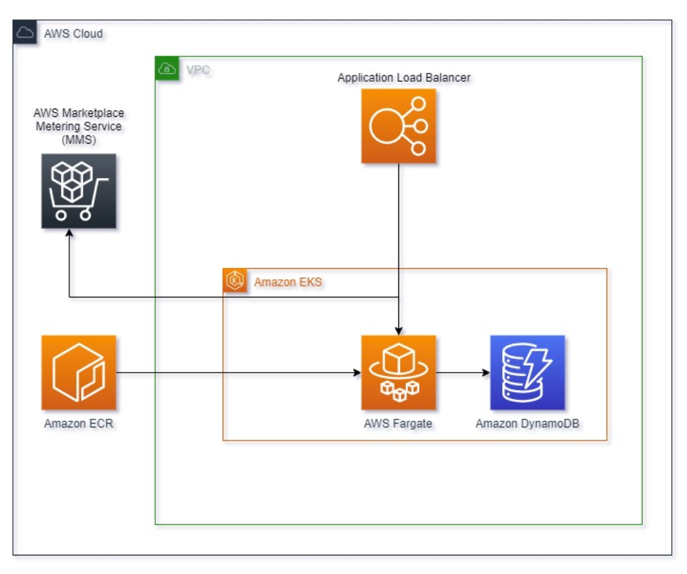
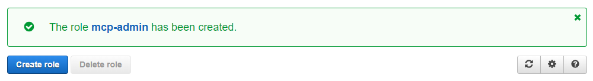
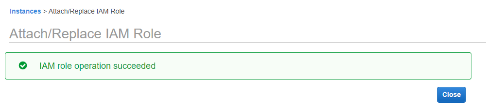
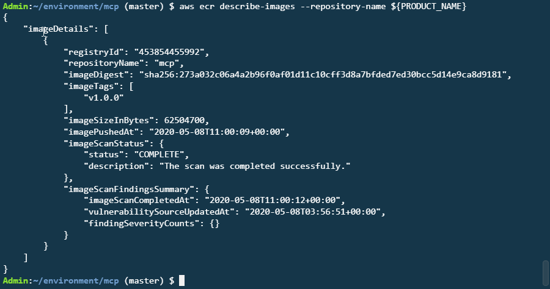
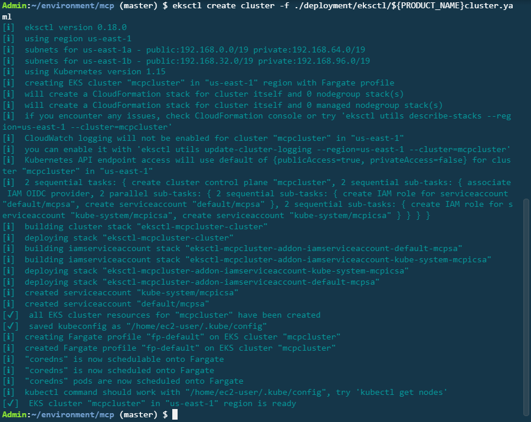
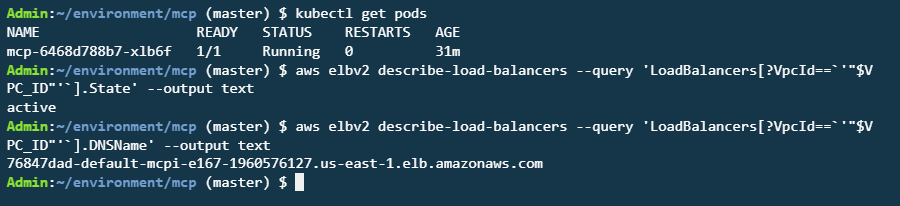
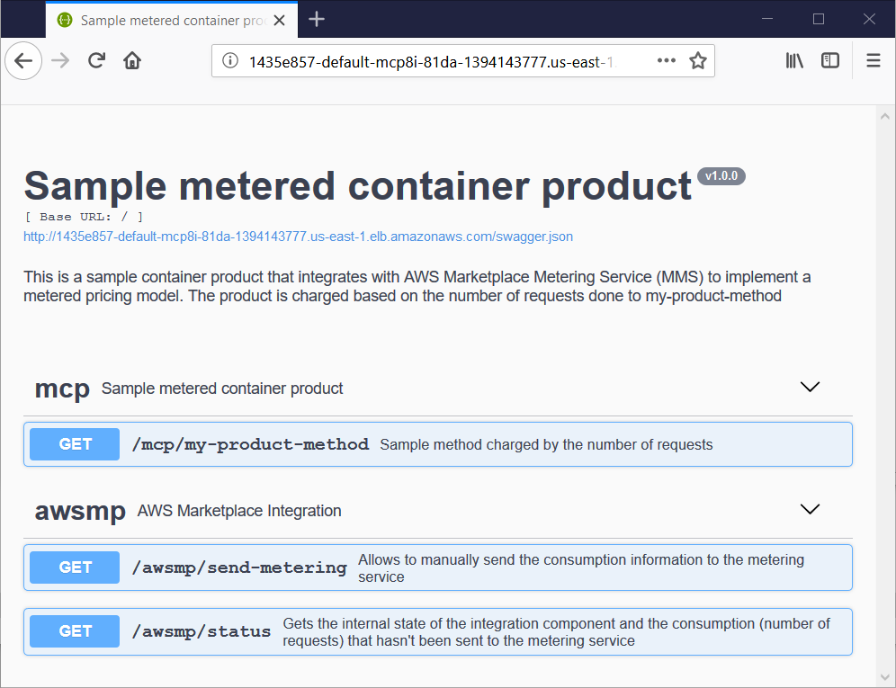

# Creating container products for AWS Marketplace using Amazon EKS & AWS Fargate

## Metered pricing in AWS Marketplace

AWS Marketplace is a digital catalog with thousands of software solutions from Independent Software Vendors (ISVs). It makes it easy for AWS customers to find, test, buy and deploy software in minutes on AWS. By listing your software in AWS Marketplace, you can reach a worldwide target audience while reducing procurement time for your customer.

AWS Marketplace offers sellers multiple delivery methods and pricing models. Delivery methods include Amazon Machine Images (AMIs), Amazon SageMaker, AWS Cloud Formation Stacks, Containers, Private Image Build and SaaS. Pricing models include hourly, monthly, yearly, and metered. The metered pricing model enables you to charge based on any unit relevant for your product. That could be for example the number of users, gigabytes of storage used, or the number of requests to an API. You specify what you want to charge for each unit. This pricing model allows buyers to pay only for what they use, so they can more easily try new products.

In this post, I show how to create a container-based software product that uses [custom metering](https://docs.aws.amazon.com/marketplace/latest/userguide/container-metering-meterusage.html) as the pricing model. For this, I show how to create a sample API that is charged based on number of requests using [AWS Marketplace Metering Service](https://docs.aws.amazon.com/marketplace/latest/userguide/metering-service.html). The product is hosted using [Amazon Elastic Kubernetes Service](https://aws.amazon.com/eks/)  (Amazon EKS) and [AWS Fargate](https://aws.amazon.com/fargate).

The ability to create [AWS Marketplace paid container products running on Amazon EKS](https://aws.amazon.com/about-aws/whats-new/2019/09/aws-marketplace-now-supports-paid-container-software-on-amazon-elastic-kubernetes-eks/) was announced in the fall of 2019. The option to run [serverless Kubernetes Pod using Amazon EKS and AWS Fargate](https://aws.amazon.com/about-aws/whats-new/2019/12/run-serverless-kubernetes-pods-using-amazon-eks-and-aws-fargate/) was announced a few months later.

You can also reuse the integration implemented for this sample product for other products, such as containers running on [Amazon Elastic Container Service](https://aws.amazon.com/ecs/) (Amazon ECS) and AMI-based metered products.

## Solution Overview

My example metered container product is a REST API that counts the number of requests to its endpoint. It then sends this information to AWS Marketplace Metering Service.

The application consists of an Amazon EKS cluster using AWS Fargate as its compute layer. The application is reachable through an [application load balancer](https://aws.amazon.com/elasticloadbalancing/). The metering information is accumulated and stored in an [Amazon DynamoDB](https://aws.amazon.com/dynamodb/) table before being sent to the AWS Marketplace Metering Service. As with every AWS Marketplace container product, the container image is stored in [Amazon Elastic Container Registry](http://aws.amazon.com/ecr/) (Amazon ECR).  

In the following diagram, you can see the architecture of the application.



I developed the application in Python, which is easy to understand, even for non-Python developers. I kept the sample application as streamlined as possible and automated several of the steps to get the product running. The application is deployed using [helm](https://helm.sh/), a tool for managing Kubernetes applications.

The application consists of two code files. One file, **api.py**, is a sample REST API that would simulate the product you would like to offer in AWS Marketplace. The second file, **marketplace.py**, is the AWS Marketplace Metering Service integration module. By encapsulating the entire AWS Marketplace integration into a single module, your product won’t require major changes to be published in AWS Marketplace. The integration module uses an injected storage object, so swapping the underlying persistence layer doesn’t require any modification on the integration component in itself. Your new storage class only has to extend the **AbstractDimensionsStorage** abstract class.

The sample application charges by the number of calls done to the method in the /mcp/my-product-method path. This is defined as a [dimension](https://docs.aws.amazon.com/marketplace/latest/userguide/pricing-container-products.html). In case you would like to charge for multiple dimensions, you only have to define them as configuration. The AWS Marketplace integration and storage objects work with multiple dimensions without any additional modification.

We recommend sending metering information on an hourly basis. You should also define how you would like your product to behave in case of a communication problem with the metering service. My sample product has two time periods defined. If the application fails to send the metering information after the first time period, a warning message is displayed so the buyers can react and fix the problem. If the problem is not fixed and the application continues to fail sending metering information after the second time period, the application stops working.

## Walkthrough

To get the sample product working, you must complete the following steps:

1. Prerequisites
2. Create and configure an AWS Cloud9 Instance
3. Create the Amazon EKS cluster with an AWS Fargate profile
4. Create a container product in the AWS Marketplace Management Portal
5. Build and upload the sample product’s image
6. Deploy the sample product
7. Clean up

### 1. Prerequisites

You need an AWS account [registered as seller](https://docs.aws.amazon.com/marketplace/latest/userguide/seller-registration-process.html) in AWS Marketplace. Providing the bank account and tax information is not necessary for this tutorial.

### 2. Create and configure an AWS Cloud9 Instance as your workstation

To follow along with this tutorial, you need a workstation. You use an AWS Cloud9 instance for this.

AWS Cloud9 is a cloud-based integrated development environment (IDE) that lets you write, run, and debug your code with just a browser. AWS Cloud9 includes a code editor, debugger, and terminal. Cloud9 comes prepackaged with essential tools for popular programming languages.

### *Create an AWS Cloud9 instance*

1. Navigate to the [AWS Cloud9](https://us-east-1.console.aws.amazon.com/cloud9/home?region=us-east-1) console.
2. In the upper right corner, select **Create environment**.
3. Enter **mcp** as its name, and select **Next step**.
4. Accept all the defaults and select **Next step**.
5. Select **Create environment**.

Creating your instance takes a few minutes.

### *Create an IAM Role for your instance*

1. Visit [this deep link to create an IAM role with Administrator access](https://console.aws.amazon.com/iam/home#/roles$new?step=review&commonUseCase=EC2%2BEC2&selectedUseCase=EC2&policies=arn:aws:iam::aws:policy%2FAdministratorAccess).
2. Confirm that **AWS service** and **EC2** are selected. To view permissions, select **Next: Permissions**.
3. Confirm that **AdministratorAccess** is checked, then select **Next: Tags** to assign tags.
4. Accept the defaults, and select **Next: Review** to review.
5. In the Name box, enter **mcp-admin**, and select **Create role**.

You should see a notification indicating your role has been created, as shown in the following screenshot.


  
### *Attach the IAM Role to your instance*

1. Visit [this link to find your Cloud9 EC2 instance](https://console.aws.amazon.com/ec2/v2/home?#Instances:tag:Name=aws-cloud9-.*mcp.*;sort=desc:launchTime).
2. Select the instance, and then choose **Actions**, and then **Instance Settings**, followed by **Attach/Replace IAM Role**.
3. From the **IAM Role** drop-down, choose **mcp-admin**. Select **Apply**.

You should see a notice of the successful creation of your IAM role, as shown in the following screenshot.



### *Update the credentials for your instance*

1. Return to your workspace. To open the Preferences tab, in the upper right, select the sprocket.
2. Select **AWS SETTINGS**.
3. Turn off **AWS managed temporary credentials**.
4. Close the Preferences tab.
5. To ensure temporary credentials aren’t already in place, you must remove any existing credentials file. Press Alt-t to open a terminal and execute the following command:

```bash
rm -vf ${HOME}/.aws/credentials
```

### *Install additional requirements in your instance*

To define the PRODUCT_NAME environment variable and clone my sample product repository, enter the following commands in the terminal. The PRODUCT_NAME variable contains the name of the product you are creating. It is used as destination while cloning my sample product repository. I named it **mcp**, but you are free to change it. Just be aware that as you work with multiple terminals, you must set the PRODUCT_NAME variable again to your chosen value.

```bash
cd ~/environment
export PRODUCT_NAME=mcp
git clone https://github.com/aws-samples/aws-marketplace-metered-container-product.git ${PRODUCT_NAME}
```

In the repository you just cloned, find the **build.sh** script. You use this script to manage the sample product development lifecycle. To install the rest of the requirements, use the **build.sh** script using the **--requirements** parameter by entering it into Terminal:

```bash
~/environment/${PRODUCT_NAME}/build.sh --requirements
cd ~/environment/${PRODUCT_NAME}
```

### 3. Creating the Amazon EKS cluster with an AWS Fargate profile

At the time of writing this post, AWS Fargate for Amazon EKS is available in N. Virginia (us-east-1), Ohio (us-east-2), Ireland (eu-west-1), and Tokyo (ap-northeast-1). You can find the [current availability for AWS services here](https://aws.amazon.com/about-aws/global-infrastructure/regional-product-services/?nc1=h_ls).

Next, you must define additional environment variables. These variables are used to configure the Amazon EKS cluster, generate the cluster configuration file, and create the cluster. I’m using the **eksctl** command line tool to automate the creation of the cluster. It uses a configuration file and creates the cluster using AWS CloudFormation.

```bash
export PRODUCT_NAME=mcp
export AWS_REGION=us-east-1
export PRODUCT_VERSION=v1.0.0
cd ~/environment/${PRODUCT_NAME}
envsubst < ./deployment/eksctl/cluster.yaml >./deployment/eksctl/${PRODUCT_NAME}cluster.yaml
eksctl create cluster -f ./deployment/eksctl/${PRODUCT_NAME}cluster.yaml
```

This will take around 15 minutes. However, you can continue with the next steps.

### 4. Creating a container product in the AWS Marketplace Management Portal

1. Navigate to the [AWS Marketplace Management Portal (AMMP)](https://aws.amazon.com/marketplace/management).
2. If you are not registered as a seller, you receive a warning message. Follow the link to **sign up** in the message and complete the registration process. Only the **Legal business name** and accepting the **Seller Terms and Condition** are mandatory for registration.
3. From the menu bar, expand **Assets**, and choose **Container**.
4. Enter a name for your product, and choose **Create**.
5. In the right column under Product Code, copy the product code.

This blog post doesn’t intend to make the sample product public in AWS Marketplace, but you can [make your real container product public by following these steps](https://docs.aws.amazon.com/marketplace/latest/userguide/container-product-getting-started.html#create-container-product).

### 5. Building and uploading the product’s image

Switch back to the browser tab with the Cloud9 instance from Step 2. Open another Terminal window by pressing **Alt-t**. You must set the environment variables again and set new ones, including one for the product code you copied in Step 4. To do that, enter these commands into your Terminal window, replacing the product code with the one you copied in Step 4:

```bash
export AWS_REGION=us-east-1
export PRODUCT_NAME=mcp
export PRODUCT_VERSION=v1.0.0
#replace the product code with the one you copied in Step 4.
export PRODUCT_CODE=<YOUR_PRODUCT_CODE_HERE>
export ECR_REPOSITORY=$(aws ecr create-repository \
    --repository-name $PRODUCT_NAME \
    --image-scanning-configuration scanOnPush=true \
    --region $AWS_REGION \
    | jq -r .repository.repositoryUri)
```

To confirm that the AWS ECR Repository was created successfully and that the ECR_REPOSITORY variable is set, execute the following command:

```bash
echo $ECR_REPOSITORY
```

To build and upload the sample product’s container image to the ECR Repository, execute the **build.sh** script as follows:

```bash
cd ~/environment/${PRODUCT_NAME}
./build.sh --upload
```

To check that the container product was uploaded properly, enter this command into Terminal.

```bash
aws ecr describe-images --repository-name ${PRODUCT_NAME}
```

You should see an output similar to the following screenshot, where the **imageScanStatus** is set to **COMPLETE**.



Security scans are run in all container products that get published in AWS Marketplace, so it’s important that the **findingSeverityCounts** property is empty ({}).

### 6. Deploying the sample product

1. Check in the first Terminal to be sure that the Amazon EKS cluster you started creating in Step 3 is fully deployed. It should look similar to the next screenshot. If it hasn’t finished yet, wait until it does and then close the Terminal.



2. In the remaining Terminal you opened in Step 5, set an environment variable to tell the application where to deploy the network load balancer. To do that, enter the AWS CLI’s **eks describe-cluster** command as follows:

```bash
export VPC_ID=$(aws eks describe-cluster --name ${PRODUCT_NAME}cluster --region $AWS_REGION  | jq -r '.cluster.resourcesVpcConfig.vpcId')
```

3. Before continuing, confirm that all environments variables are set. To do this, enter the following **echo** commands:

```bash
echo $AWS_REGION
echo $PRODUCT_NAME
echo $PRODUCT_VERSION
echo $PRODUCT_CODE
echo $VPC_ID
echo $ECR_REPOSITORY
```

4. To deploy the product, enter the script **build.sh** with the **--deploy** parameter in Terminal:

```bash
./build.sh --deploy
```

5. You can see the product being started by entering the following command.

```bash
kubectl get pods
```

6. As part of the deployment, the application creates an Application Load Balancer. It takes a couple of minutes for this Load Balancer to get provisioned and active. To check whether the Load Balancer’s is active, enter the AWS CLI’s **elbv2 describe-load-balancers** command as follows:

```bash
aws elbv2 describe-load-balancers --query 'LoadBalancers[?VpcId==`'"$VPC_ID"'`].State' --output text
```

That command returns empty or provisioning if the Application Load Balancer isn’t ready yet. If it returns isn’t active, wait a minute or two and enter the command again.

Once you get **active** as output to that command, you can get the application endpoint with the following command:

```bash
aws elbv2 describe-load-balancers --query 'LoadBalancers[?VpcId==`'"$VPC_ID"'`].DNSName' --output text
```

In the following screenshot, you can see the execution of Steps 6.5 and 6.6:



7. Visit the application’s endpoint you got in Step 6.6 in a new web browser tab. My sample container product has three GET methods.

* The **my-product-method** represents your product and the request are tracked and send to AWS Marketplace.
* The **send-metering** allows you to manually send the current number of requests to AWS Marketplace. This is only for testing and debugging purposes. The Marketplace Integration component takes care of the sending this metering information automatically on an hourly basis.
* The **status** method shows the internal state of the integration component and the number of requests done to the my-product-method that hasn’t been sent to the metering service yet.

You can watch the application running, as shown in the following screenshot.



You can now experiment with the code. I implemented the **--upgrade** parameter in the **build.sh** script to facilitate the experimentation process for you. This parameter automates the build and upload of the container image and deploy the application to the Amazon EKS cluster automatically.

```bash
./build.sh --upgrade
```

### *Recommendations*

In this post, I provide a basic reference implementation of the integration with AWS Marketplace. I avoided complicating the implementation with extensive exception handling. My recommendation is to experiment with the code and make any customizations you would like. You can find the integration and product source code in your repository local copy in the app subfolder. The **api.py** is the product implementation, and the **marketplace.py** is the marketplace integration module.

I developed the integration module to be extensible. For example, you might want to change the service used for the persistence storage because it makes sense for your product. You could do this by just extending the **AbstractDimensionsStorage** and inject your newly created persistence object in the **MeterUsageIntegration** instance.

There are important points to consider when creating real products:

* [A multistage Docker build](https://docs.docker.com/develop/develop-images/multistage-build/) results in a leaner image with only the software bits required to run your application. This reduces possible attack vectors as well.
* The AWS Marketplace Integration component could be created as separate pods and be used independently in a microservice architecture.
* You can use AWS CloudFormation rather than eksctl to create your EKS cluster. To get the AWS CloudFormation template generated by eksctl in this tutorial and use it as starting point, visit the AWS CloudFormation Console, select the Stack containing the name you chose in Step 3, and check the **Template** tab. If you didn’t change the product name, the Stack should contain the name **mcp**.  
* To enable you to provide your product code, in this blog post, I parametrized the product code as an environment variable. With a real product, you would like to prevent the product code to be modifiable by the user to prevent [metering modification](https://docs.aws.amazon.com/marketplace/latest/userguide/entitlement-and-metering-for-paid-products.html#prevent-metering-modification).
* For container products, users have access to the product’s images. If your software is written in an interpreted language, buyers could see your code and even deactivate the metering mechanism. For a metered container product, I recommend using a compiled language or compile your interpreted language if possible. You can also consider obfuscating your code.
* A buyer could tamper with your dimension storage data. You should implement a mechanism to detect or prevent it.

### 7. Cleaning up

To avoid incurring future charges, you must delete the resources created in this post. To do this, call the **build.sh** script with the **--cleanup** parameter in a Terminal window:

```bash
./build.sh --cleanup
```

After the uninstall scripts ends, verify in the AWS [CloudFormation console](https://console.aws.amazon.com/cloudformation) that the Stack containing the name you chose in Step 3 as your product name is deleted successfully. If you didn’t change the product name, the Stack should contain the name **mcp**. Also in the [AWS Cloud9 Console](https://us-east-1.console.aws.amazon.com/cloud9/home?region=us-east-1), select the Cloud9 instance and delete it.

## Conclusion

In this post, I introduced a sample container product that integrates with AWS Marketplace Metering Service to implement a [custom metering](https://docs.aws.amazon.com/marketplace/latest/userguide/container-metering-meterusage.html) pricing model. The buyer pays for the number of requests done to a specific method. The product is hosted using Amazon EKS and AWS Fargate. The serverless nature of AWS Fargate allows you to offer a product for which your buyers don’t need to manage the underlying compute layer. This can help provide a better customer experience.

AWS Marketplace allows you to reach a global audience and offer easy procurement and deployment to your buyers. It also offers additional pricing models and technology to host your product. You can find additional information [in the AWS Marketplace seller guide](https://docs.aws.amazon.com/marketplace/latest/userguide/what-is-marketplace.html). Or get in [contact with us](https://aws.amazon.com/marketplace/management/contact-us).

I hope you found this post useful. I’m planning to expand the reference integration module to additional kind of products, pricing models, and programming languages. I’m really eager to hear your feedback about which integration you would like to see next and your experience with the one released with this blog post. Email me at aws-mp-integration-feedback@amazon.com.

## License Summary

This sample code is made available under a modified MIT license. See the LICENSE file.
